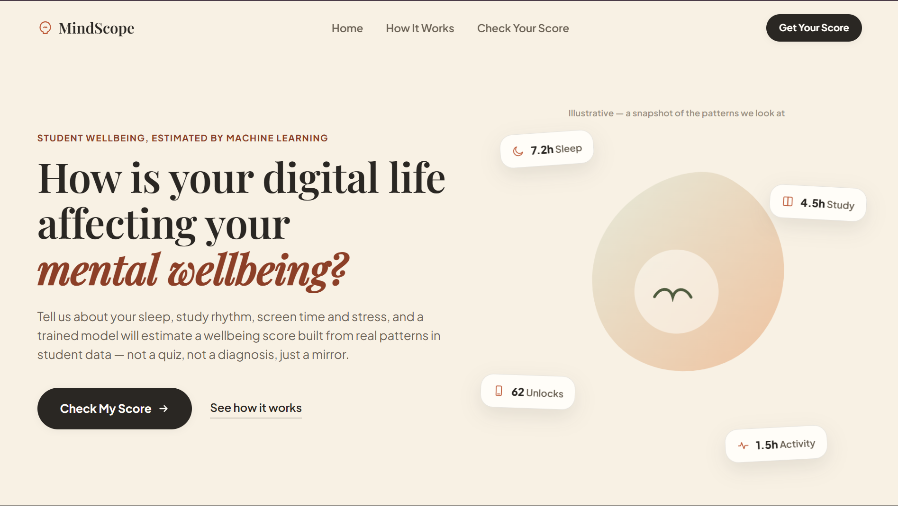
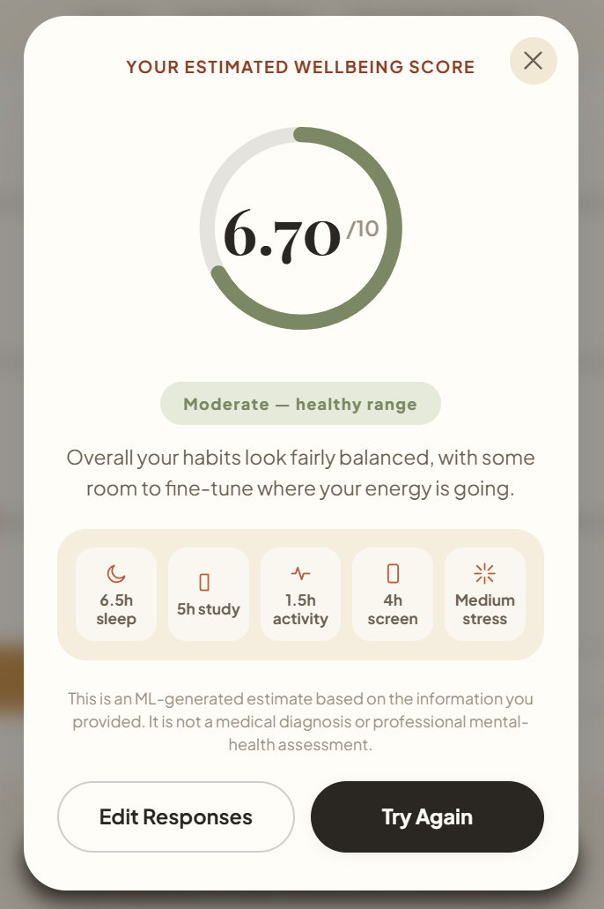

# 🌿 MINDRA — AI-Powered Mental Wellbeing Predictor

<p align="center">
  <b>An AI-powered mental wellbeing prediction system that analyzes lifestyle patterns and provides personalized wellbeing insights.</b>
</p>

<p align="center">


</p>


---

# 🧠 Overview

**MINDRA** is an AI-based mental wellbeing prediction system designed to estimate a user's overall wellbeing score by analyzing daily lifestyle habits.

The project combines **Machine Learning and Human-Centered UI Design** to help users understand how their lifestyle patterns influence their overall wellbeing.

The system takes user inputs such as:

- 😴 Sleep duration
- 📚 Study hours
- 🏃 Physical activity
- 📱 Screen time
- 😰 Stress level

and generates:

- 📊 Wellbeing Score (0-10)
- 🌱 Wellbeing Category
- 💡 Lifestyle Insights


> ⚠️ **Disclaimer:**  
> MINDRA provides an ML-generated wellbeing estimate for self-awareness purposes only. It is not a medical diagnosis, nor does it replace professional mental health support.


---

# ✨ Features


## 🤖 Machine Learning Based Prediction

- Predicts an estimated wellbeing score using lifestyle parameters
- Uses trained machine learning models
- Converts numerical predictions into understandable wellbeing categories
- Provides instant user feedback


Example:

```
Estimated Wellbeing Score

6.18 / 10

MODERATE — HEALTHY RANGE
```


---

# 📊 Lifestyle Analysis


MINDRA evaluates different lifestyle factors:


| Factor | Description |
|---|---|
| 😴 Sleep | Daily sleeping hours |
| 📚 Study | Study/work duration |
| 🏃 Activity | Physical activity level |
| 📱 Screen Time | Digital device usage |
| 😰 Stress | Stress intensity level |


---

# 🎨 UI / UX Design


MINDRA follows a modern wellness-focused interface inspired by:

- Pinterest editorial layouts
- Calm wellness applications
- Headspace design philosophy
- Modern SaaS products


### Design Highlights

✅ Soft wellness color palette  
✅ Premium typography  
✅ Smooth animations  
✅ Responsive layout  
✅ Minimal and clean interface  
✅ Mobile-friendly experience  


---

# 🖼️ Screenshots


## 🏡 Main Application Interface


The main interface allows users to enter their lifestyle information and receive an AI-based wellbeing assessment.


<p align="center">
  
</p>


---

## 🌿 Wellbeing Score Prediction Result


After processing user inputs, MIND generates a wellbeing score along with lifestyle insights and habit analysis.


<p align="center">
  
</p>


### Result Dashboard Includes:

- 📊 Overall wellbeing score visualization
- 🌱 Wellbeing category classification
- 😴 Sleep analysis
- 📚 Study pattern insights
- 🏃 Physical activity summary
- 📱 Screen time evaluation
- 😰 Stress level indicator


---

# 🏗️ System Architecture


```
                    User Input

                        |
                        |

       Sleep | Study | Activity | Screen | Stress

                        |
                        |

              Data Preprocessing

                        |
                        |

              Machine Learning Model

                        |
                        |

             Wellbeing Score Prediction

                        |
                        |

              Result Visualization

                        |
                        |

              User Insight Report

```


---

# 🛠️ Tech Stack


## Frontend

| Technology | Purpose |
|---|---|
| HTML5 | User interface structure |
| CSS3 | Styling and responsive design |
| JavaScript | Client-side interaction |


---

## Machine Learning


| Technology | Purpose |
|---|---|
| Python | ML development |
| Pandas | Data processing |
| NumPy | Numerical computation |
| Scikit-Learn | Model training and prediction |
| Matplotlib | Data visualization |


---

## Backend


| Technology | Purpose |
|---|---|
| Python | Backend logic |
| REST API | Model communication |


---

# 📂 Project Structure


```
MINDRA/

│
├── frontend/
│   │
│   ├── index.html              # Main UI page
│   ├── script.js               # Frontend logic
│   └── style.css               # UI styling
│
│
├── screenshots/
│   │
│   ├── main-screen.png         # Application main interface
│   └── result.png              # Wellbeing prediction result
│
│
├── main.py                     # Backend and prediction logic
│
├── Mental_Health_Model....     # Trained ML model file
│
├── ML_Project.ipynb            # Model training notebook
│
├── ML Project.html             # Notebook exported HTML file
│
├── requirements.txt            # Python dependencies
│
├── LICENSE                     # Apache License 2.0
│
├── README.md                   # Project documentation
│
└── Student Social Media ....   # Additional project resource

```


---

# ⚙️ Installation & Setup


## 1. Clone Repository


```bash
git clone https://github.com/yourusername/MINDRA.git

cd MINDRA
```


---

# 🐍 Backend Setup


Create virtual environment:


```bash
python -m venv venv
```


Activate environment:


### Windows

```bash
venv\Scripts\activate
```


### Linux / macOS

```bash
source venv/bin/activate
```


Install dependencies:


```bash
pip install -r requirements.txt
```


Run application:


```bash
python main.py
```


---

# 🌐 Frontend Setup


Open:

```
frontend/index.html
```


or run using:

- VS Code Live Server
- Any local web server


---

# 🔬 Machine Learning Workflow


## 1. Data Collection

Lifestyle information is collected from user inputs.


## 2. Data Processing

Input values are cleaned and transformed into machine learning compatible features.


## 3. Model Prediction

The trained model predicts:


```
Wellbeing Score → 0 to 10
```


## 4. Result Generation

The system displays:

- Prediction score
- Wellbeing category
- Lifestyle breakdown


---

# 📈 Future Enhancements


## 🤖 AI Improvements

- AI-powered wellness assistant
- Personalized lifestyle recommendations
- Mood tracking chatbot


## 🧠 ML Improvements

- Larger real-world datasets
- Advanced machine learning models
- Deep learning integration
- Continuous learning pipeline


## 🚀 Application Improvements

- User authentication
- Personal wellbeing dashboard
- Progress tracking
- Mobile application
- Cloud deployment


---

# 🔐 Privacy & Responsible AI


MINDRA follows responsible AI practices.

The application:

- Does not diagnose mental health conditions
- Does not replace professional healthcare
- Provides predictions only for awareness and self-reflection


---

# 👨‍💻 Developer


## Abhik Kundu

B.Tech Computer Science Engineering  
Specialization: Artificial Intelligence & Machine Learning


### Interests

- Artificial Intelligence
- Machine Learning
- Full Stack Development
- Human-Centered AI Applications


---

# 🤝 Contributing


Contributions are welcome!


Steps:

1. Fork this repository

2. Create a new branch:

```bash
git checkout -b feature-name
```


3. Commit changes:

```bash
git commit -m "Added new feature"
```


4. Push changes:

```bash
git push origin feature-name
```


5. Create a Pull Request


---

# 📜 License


This project is licensed under the **Apache License 2.0**.


You are free to:

- Use
- Modify
- Distribute
- Contribute


under the terms and conditions of the Apache License 2.0.


See the complete license:

```
LICENSE
```


---

# ⭐ Support


If you find this project useful, consider giving it a ⭐ on GitHub.

Your support helps improve **MINDRA** 🌿